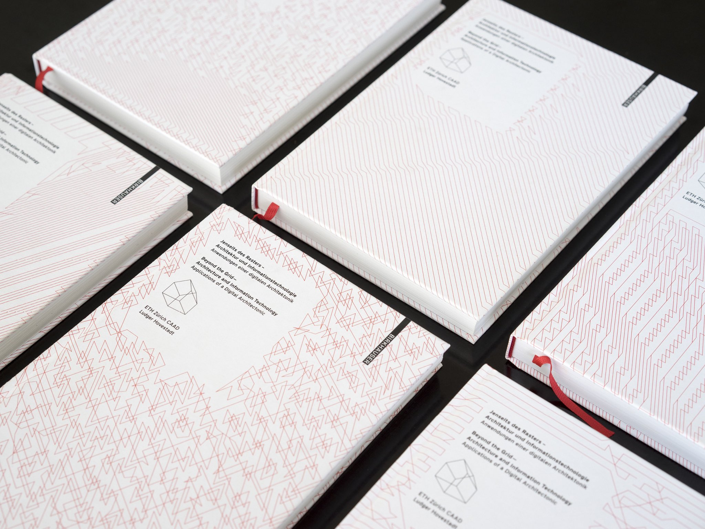
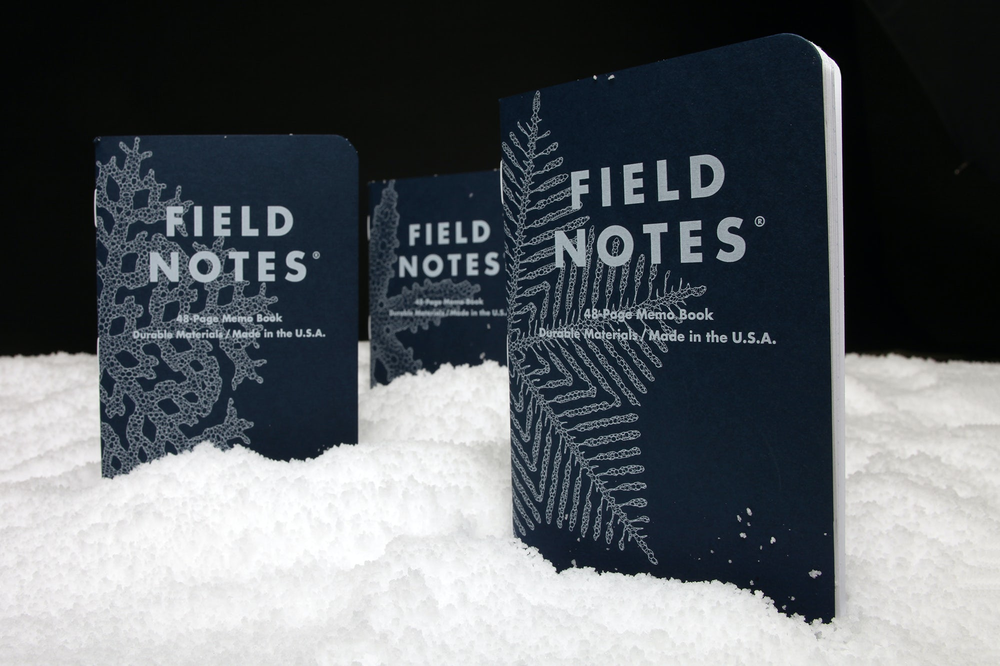
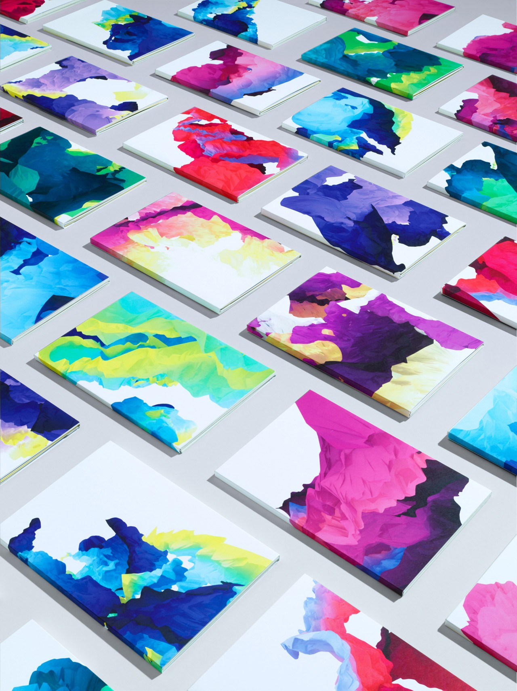
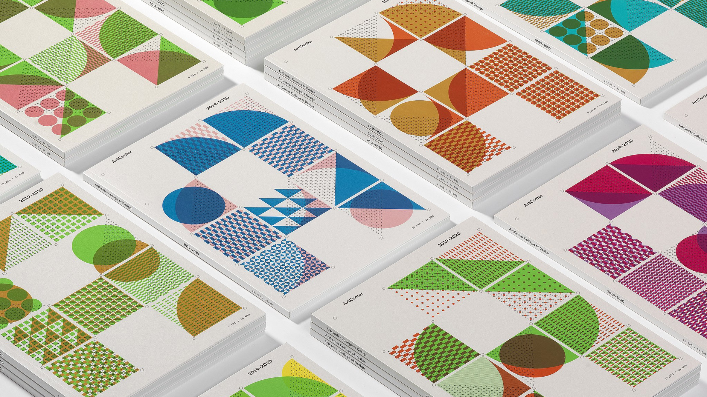
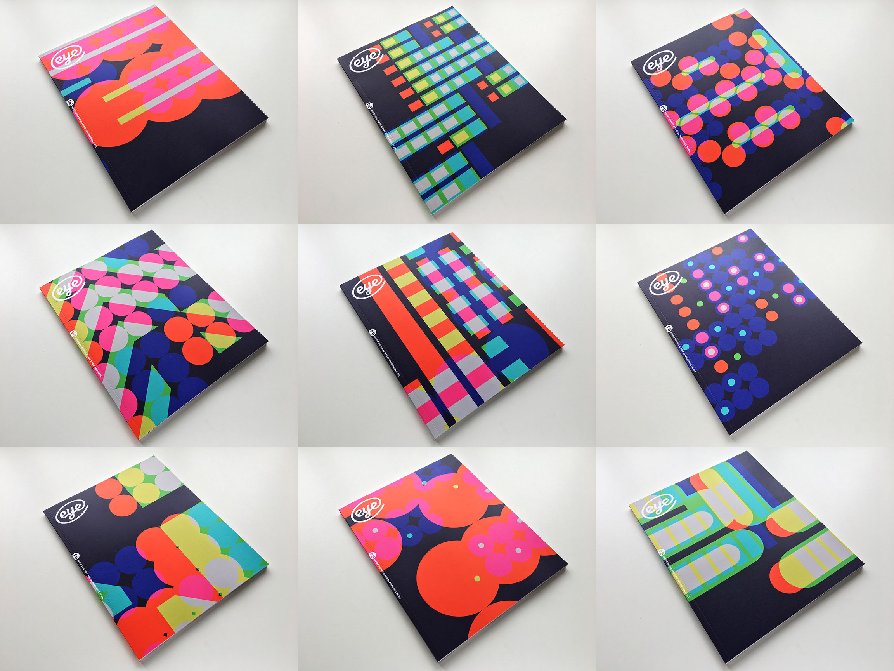
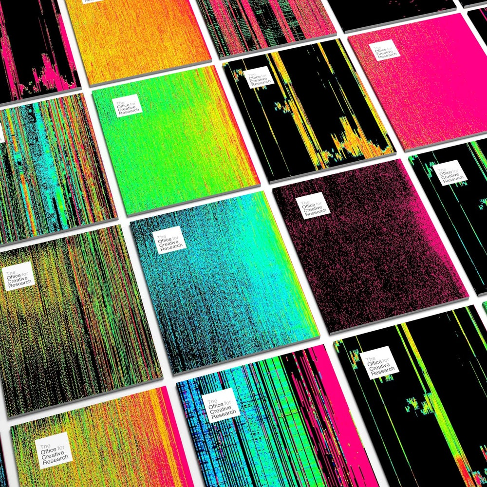
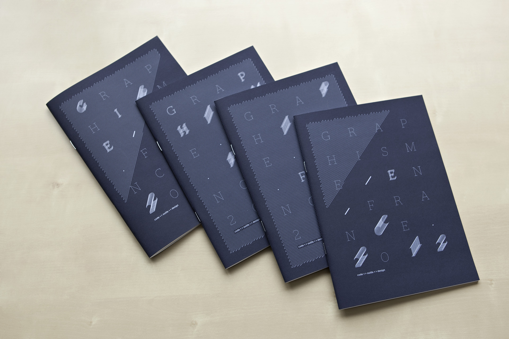
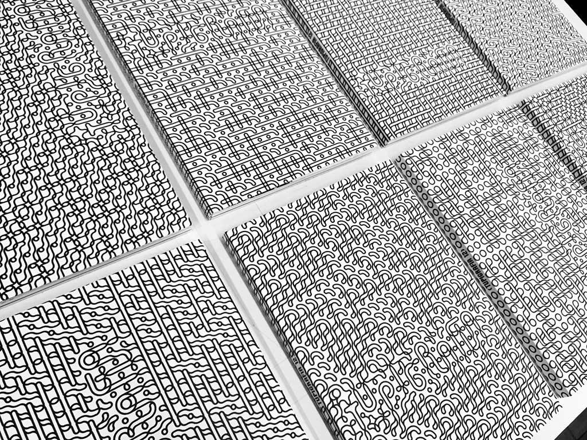
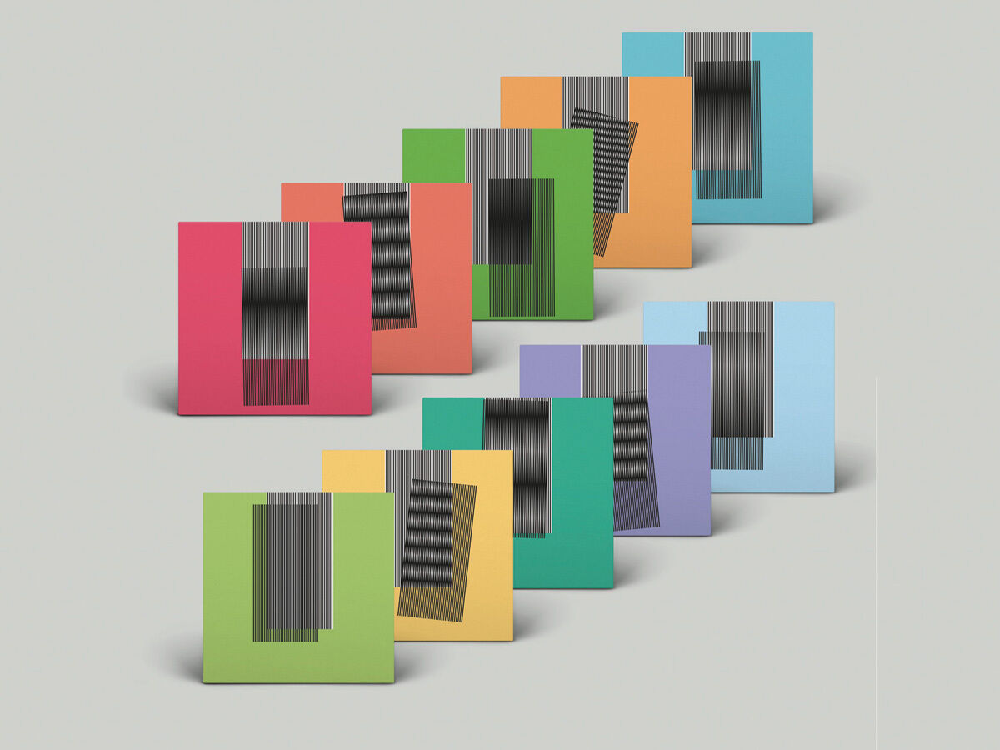
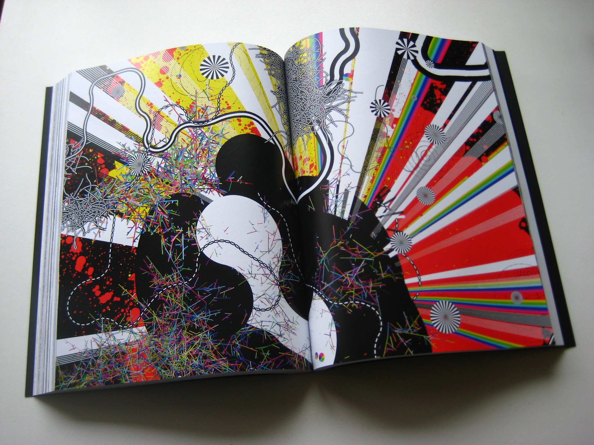

## Generative Book Covers

This document compiles examples of large-run printed books with generative cover designs. For the purposes of this repository, "generative" means each copy is unique, and "large run" means this document does not consider print-on-demand.

The purpose of this page is to help you convince your reluctant publisher that *Yes, This Is Possible, It's Really Cool, And It's Not That Difficult.*

These materials were originally presented in a Twitter thread [here](https://twitter.com/golan/status/1282703748188590082). Thanks to everyone who contributed links.

--- 

 In 2009, for the book "Beyond the Grid: Architecture and Information Technology“ (ISBN: 9783034600965) by Ludger Hovestadt, the press De Gruyter - Birkhäuser printed unique, computationally-generated covers for each copy. [**LINK**](https://twitter.com/W0RB1T/status/1275923495487242240) 

---

Generative artist Brendan Dawes was invited to create 99,999 unique covers for the 2020 *Field Notes Winter Edition* of their popular sketchbooks. Dawes developed a procedural snowflake generator in Houdini. Dawes' development process of this "Snowy Evening" cover art series is discussed in a Field Notes blog post. [**LINK**](https://fieldnotesbrand.com/dispatches/2020/snowmaker).

---

 In 2016, Penguin Books re-released Richard Dawkins' books with unique, computationally generated covers created using Dawkins' *Blind Watchmaker* software. [**LINK**](https://format.com/magazine/resources/design/richard-dawkins-unique-book-covers)

---

 
In 2012, London-based design studio Field.io generated 10,000 unique covers for GF Smith’s annual paper brochure. [**LINK**](https://www.field.io/project/digital-paintings/)

---

 For the cover of the 2019 viewbook for ArtCenter College of Design, 40,500 unique cover designs were computationally generated, each of which is individually numbered. The Viewbook is shortlisted in the graphic design category of the 2019 Dezeen Awards. [**LINK**](https://www.dezeen.com/2019/10/15/artcenter-viewbook-modernist-design/)

---

 In 2017, for the annual Typography Special of Eye magazine, design studio MuirMcNeil generated 8,000 unique front covers. [LINK](https://www.dezeen.com/2017/09/11/muirmcneil-8000-unique-covers-eye-magazine-design-graphics/)

---

 For their 2015 self-published journal, NYC design studio Office of Creative Research printed 500 unique data-generated covers. [**LINK**](https://ocrjournal.bigcartel.com/product/ocr-journal-001)

---

 10,000 generative covers by Pentagon.fr for the "Graphics in France" 18th edition, "*code <> tools <> Design*" for the National Center for Visual Arts (CNAP), 2012. [**LINK**](https://www.pentagon.fr/projets/graphisme-en-france/)

--- 

 In 2018, for Issue 12 of the Brazilian design magazine *Tupigrafia*, 400 copies were printed with unique covers generated with Processing. [**LINK**](https://contrast.parts/Tupigrafia)

---

 *Why Make Sense?* (2015) is the sixth studio album by English electronic music band, Hot Chip. For vinyl and compact disc copies, the album's cover art was printed with 130,000 variations of its design, a Moiré interference pattrn. This album cover was nominated for *Design of The Year* by the London Design Museum. [**LINK**](https://en.m.wikipedia.org/wiki/Why_Make_Sense%3F)

---

### Related Projects

In 2010, Hyperwerk students Martin Fuchs and Peter Bichsel used digital print-on-demand techniqiues to create [*Written Images*](http://writtenimages.net/), an entirely procedurally generated book in which each of the 230 uniquely-calculated copies compiled unique images produced by generative software created by 42 different artists. [**LINK**](https://vimeo.com/18220979)

---

Nick Montfort maintains a list of [computer-generated books](https://nickm.com/post/2016/07/computer-generated-books/).
